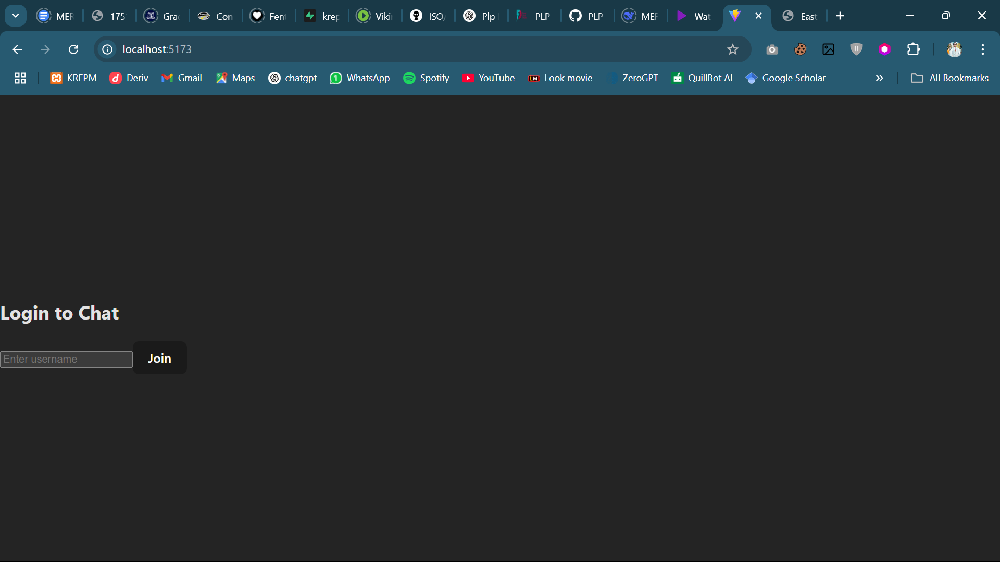

# 💬 Real-Time Chat Application with Socket.io

A modern, full-stack real-time chat app built with **React**, **Express**, and **Socket.io**. Features include global and private messaging, chat rooms, typing indicators, file sharing, read receipts, notifications, and more.

---

## 🚀 Features

- **Real-time messaging** (Socket.io)
- **User authentication** (username-based)
- **Global chat room** and **multiple channels**
- **Private messaging** between users
- **Typing indicators** and online status
- **File/image sharing**
- **Read receipts** and message reactions
- **Sound & browser notifications**
- **Unread message count**
- **Message search & pagination**
- **Responsive design** (desktop & mobile)
- **Reconnection logic** for seamless UX

---

## 🗂️ Project Structure

```
socketio-chat/
├── client/                 # React front-end
│   ├── public/             # Static files (favicon, notification.mp3, etc.)
│   ├── src/                # React source code
│   │   ├── components/     # UI components
│   │   ├── context/        # React context providers
│   │   ├── hooks/          # Custom React hooks
│   │   ├── pages/          # Page components (ChatRoom, PrivateChat, etc.)
│   │   ├── socket/         # Socket.io client setup
│   │   └── App.jsx         # Main application component
│   └── package.json        # Client dependencies
├── server/                 # Node.js back-end
│   ├── config/             # Configuration files
│   ├── controllers/        # Socket event handlers
│   ├── models/             # Data models
│   ├── socket/             # Socket.io server setup
│   ├── utils/              # Utility functions
│   ├── server.js           # Main server file
│   └── package.json        # Server dependencies
└── README.md               # Project documentation
```

---

## 🛠️ Getting Started

### Prerequisites

- [Node.js](https://nodejs.org/) (v18+)
- npm or yarn

### Setup

1. **Clone the repository:**
   ```sh
   git clone <your-repo-url>
   cd socketio-chat
   ```

2. **Install server dependencies:**
   ```sh
   cd server
   npm install
   ```

3. **Install client dependencies:**
   ```sh
   cd ../client
   npm install
   ```

4. **Start the server:**
   ```sh
   cd ../server
   npm run dev
   ```

5. **Start the client:**
   ```sh
   cd ../client
   npm run dev
   ```

6. **Open your browser:**  
   Visit [http://localhost:5173](http://localhost:5173)

---

## ✨ Screenshots




## 📦 Main Files

- `client/src/pages/ChatRoom.jsx` — Main chat interface
- `client/src/pages/PrivateChat.jsx` — Private messaging
- `client/src/socket/socket.js` — Socket.io client logic
- `server/server.js` — Express & Socket.io server

---

## 📋 Assignment Tasks

- [x] Core chat functionality (global room, usernames, timestamps)
- [x] Private messaging & chat rooms
- [x] Typing indicators, file sharing, read receipts
- [x] Real-time notifications (sound, browser, unread count)
- [x] Pagination, search, reconnection, responsive design

---

## 🌐 Resources

- [Socket.io Documentation](https://socket.io/docs/v4/)
- [React Documentation](https://react.dev/)
- [Express.js Documentation](https://expressjs.com/)

---

## 📝 Submission

- Complete both client and server features
- Add at least 3 advanced chat features
- Document your setup and features in this README
- Include screenshots or GIFs
- (Optional) Deploy and add your live URLs here

---

## 📣 License

MIT

---

_Developed for the Week 5 Real